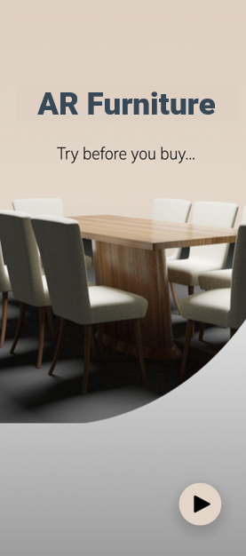
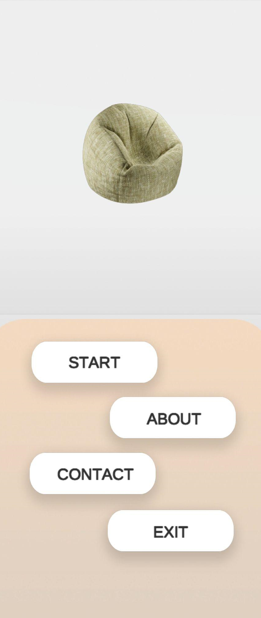
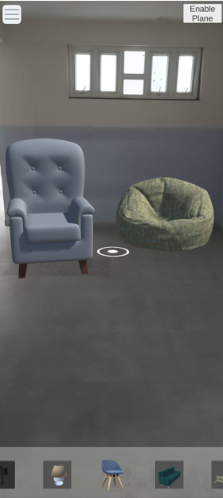
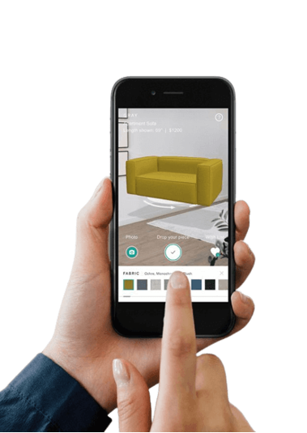
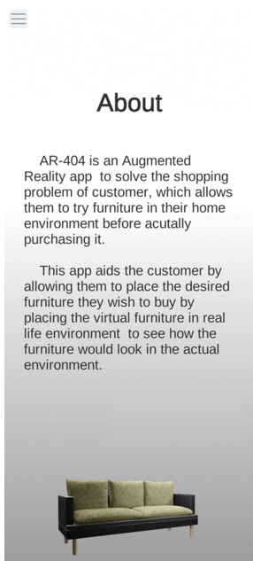

# ARchSpace – Interior Design Workbench

## Overview

ARchSpace is a mobile-based augmented reality (AR) interior design workbench built using Unity (AR Foundation). The application allows users to design interior spaces in real-time by placing structural elements, materials, furniture, and lighting using AR.

The goal is to simulate a professional interior design workflow on a smartphone or tablet.

## Core Concept

The system combines:

- Real-world environment detection (AR)
- Interactive object placement
- Category-based design system

Users can build a room layout by selecting elements and placing them in physical space.

## Technology Stack

- Unity Engine (2022.x)
- AR Foundation (cross-platform AR)
- ARCore (Android support)
- C# (scripting)

## Functional Modules

### 1. AR Placement Engine

- Uses AR Plane Manager for surface detection
- Uses AR Raycast Manager for touch-based placement
- Instantiates selected prefabs on detected planes

### 2. Prefab System

Objects are organized as prefabs into categories:

- Structure: Walls, Floors
- Materials: Wood tiles, Marble surfaces
- Furniture: Chairs, Tables, Sofas
- Lighting: Lamps (with light components)

### 3. Category-Based Selection System

UI allows switching between categories:

- Structure
- Material
- Furniture
- Lighting

Each category displays corresponding items. Selecting an item updates the active object for placement.

### 4. Object Placement Workflow

1. User selects a category
2. User selects an item (prefab)
3. User taps on detected surface
4. Object is instantiated at that position
5. Multiple objects can be placed to build a scene

## Screenshots

<div align="center">






</div>

## Download

- Android APK: `ARchSpace.apk`

## Repository

```bash
git clone https://github.com/1WN24CS203/ARchSpace-
```
